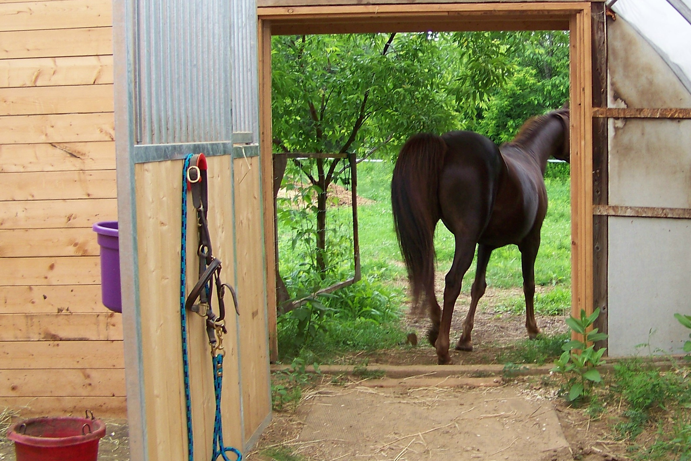

# [fit] Security

---

# [fit] What do we mean by security?

<br>

# [fit] Protection against
# [fit] theft, damage, or
# [fit] denial of access
# [fit] of systems or information.

---

# [fit] Some definitions

---

# [fit] Attack surface

- The total of all points of interaction or interface where an attacker could attempt to affect the system

---

# [fit] Backdoor

- Mode of operation unknown to the operator of the system that is intended to give access to the creator of the system or some designated third party.

---

# [fit] Denial of Service

- The removal of normal, performant, access to authorized users
  - Overloading the system
  - Redirecting access to the system

---

# [fit] Eavesdropping (man in the middle)

- Copying of information, typically `in flight`, by an unauthorized person without the knowledge of the sender or the receiver

---

# [fit] Spoofing

- Making another system or resource appear to be a legitimate version of the target system. Intended to have authorized users interact with the spoofed system and provide information the attacker can then use to access the real system.

---

# [fit] Privilege escalation

- Promotion of the authorization allowed a user to a level above their normal access. Supposes that the attacker has normal, though low privilige, access to the target.

---

# [fit] Social engineering

- The use of psychological and emotional factors of human beings to gain access to a system. Surprising one of the most effective attacks of systems.

---

# Where do security vulnerabilities come from?

- Misunderstanding of a protocol
- Misunderstanding of the attack surface
- Lack of attention to security.
- Poor requirements
- Incorrect implementation
- Ignorance
- Unintended side-effects
- Unknown side-effects

---

# So how would we address some of these?

- What if we could **prove** our code does what we say it does?

---

# Traditionally done via testing

---

# Proof systems

- Apply the formal specification of proofs to software/code

---

# Create a formal specification to discuss code

- Example: `coq`

```
Inductive nat : Type :=
  | O : nat
  | S : nat → nat.
```

- O is a natural number (note that this is the letter "O," not the numeral "0").
- S is a "constructor" that takes a natural number and yields another one — that is, if n is a natural number, then S n is too.

---

# Define `predecessor`

```
Definition pred (n : nat) : nat :=
  match n with
    | O => O
    | S n' => n'
  end.
```

# The second branch can be read: "if n has the form S n' for some n', then return n'."

---

# Formal logic to prove our code

- Must express it with far more detail than traditional programming
- No loops, etc.
- Far more complex

---

# What does it guarantee?

- Guarantees that for known inputs the program operates as specified
- **NO SIDE EFFECTS**

^ No side effects is the big deal

---

# Formal proof systems can output code

- So we write our code as proofs of "Given X, show that Y is true"
- Turn that into code we run

---

# [fit] Seems perfect

# [fit] UNHACKABLE CODEZ!!!!1!

---

# [fit] Not so fast!

---

# We aren't in control of *everything*

---

# [fit] Example

---

# [fit] Row Hammer attack on DRAM

---

# Row Hammer

- By applying (writing) a value to DRAM at a high rate of speed we can affect adjacent memory cells due to leaking of charge
- Possible to change the value of another memory location *NOT* in the scope of your program.
- Has been demonstrated _in the wild_

---

# Consequences

- So even if we were able to prove our code is 100% correct and has no unintended side effects...
- If we are allowed to write memory at a high enough speed, we could alter the system.
- Once altered, no guarantee is present

---

# Mitigation

- Refresh the DRAM at a faster rate, removes attack surface
- Disallow writes to the same memory cell at high speeds

---



^ That horse has left the barn

---

> Because as we know, there are known knowns; there are things we know we know.

> We also know there are known unknowns;

> that is to say we know there are some things we do not know.

> But there are also unknown unknowns – the ones we don't know we don't know

-- Donald Rumsfeld

---
